# Breathe


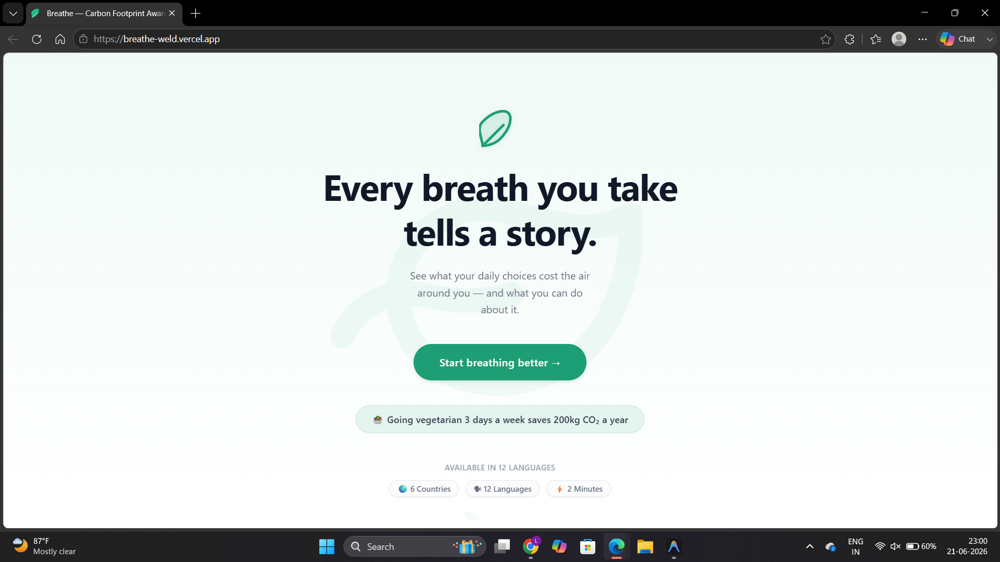

**Every breath you take tells a story.**

Breathe is an AI-powered carbon footprint awareness platform designed to help users understand, track, and reduce their environmental impact through personalized insights, real-world comparisons, and actionable recommendations.

Built for **Prompt Wars Virtual Challenge #3**.

---

## Live Demo

https://breathe-weld.vercel.app/

---

## Problem Statement

Most carbon footprint calculators provide users with numbers but fail to explain what those numbers actually mean in everyday life.

Breathe transforms carbon emission data into relatable comparisons, personalized recommendations, and interactive simulations that help users understand the impact of their daily choices and encourages sustainable behavior through awareness rather than statistics alone.

---

## Features

* Carbon footprint calculation
* Real-world carbon impact comparisons
* Country-wise footprint analysis
* Category-wise emission breakdown
* AI-powered sustainability recommendations
* Interactive "What If" simulator
* Monthly footprint tracking
* Personalized chatbot assistance
* User-friendly and responsive interface
* Support for 6 countries
* Available in 12 languages

---
## Product Showcase

## Application Preview

### Landing Page


The landing page introduces the awareness-first carbon footprint journey.

---

### Country Selection

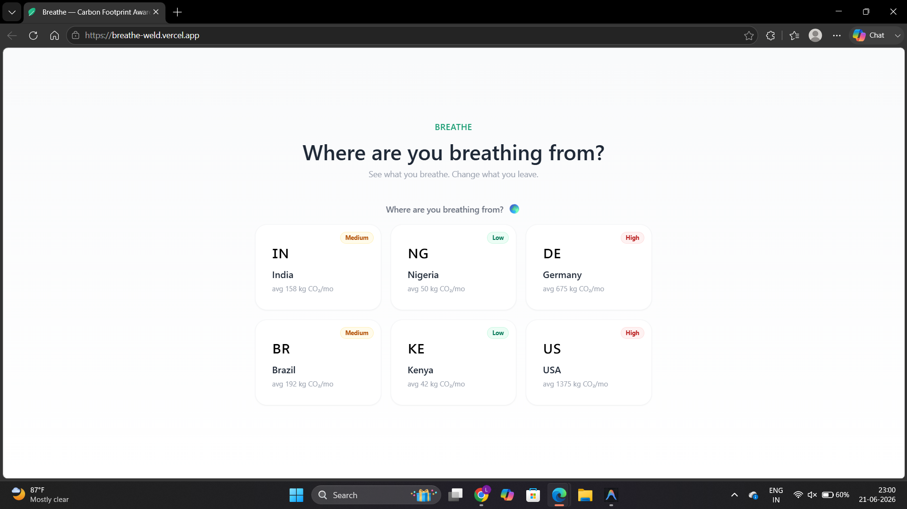

Users can select their country to receive localized emission factors and region-specific comparisons.

---

### Multilingual Support

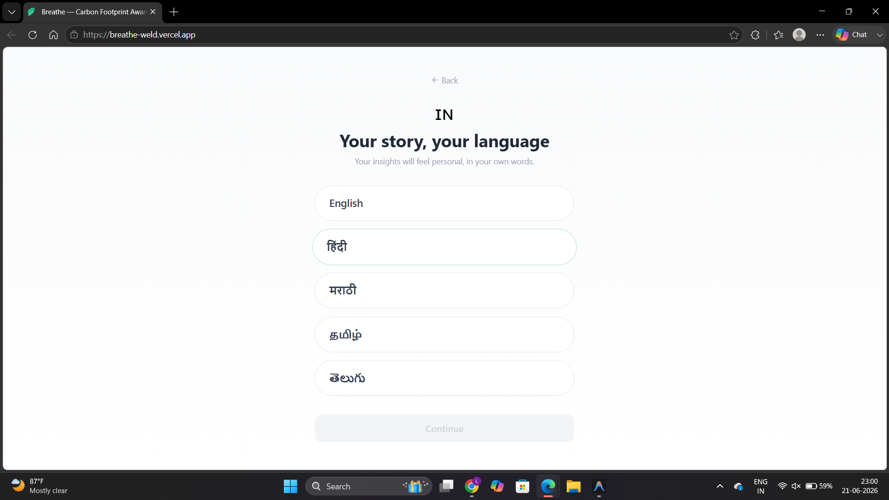

Breathe supports 12 languages, making sustainability insights accessible to a broader audience.

---

### Personalized Dashboard

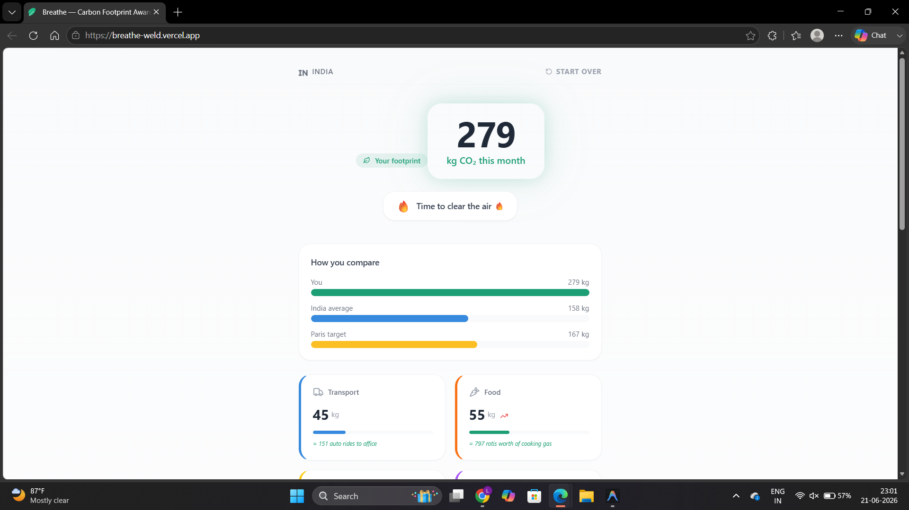

The dashboard converts carbon emissions into understandable metrics, comparisons, and category-wise breakdowns.

---

### What-If Simulator

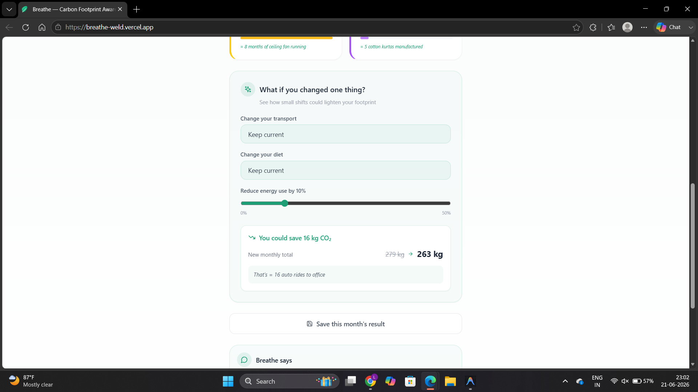

Users can explore how lifestyle changes impact their carbon footprint through interactive simulations.

---

### AI Sustainability Assistant

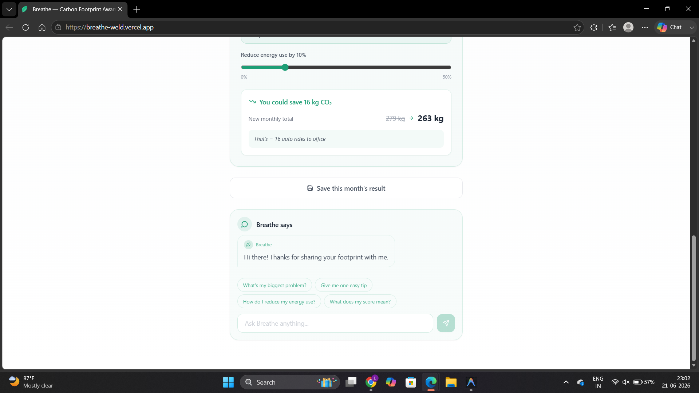

An AI-powered assistant provides personalized sustainability guidance and actionable recommendations.


## Supported Countries

* India
* United States
* Germany
* Brazil
* Kenya
* Nigeria

---

## Supported Languages

* English
* Hindi
* Marathi
* Bengali
* Tamil
* Telugu
* German
* Portuguese
* Swahili
* Yoruba
* Hausa
* French

---

## Why Breathe?

Most carbon calculators stop at displaying a number.

Breathe focuses on awareness by converting emissions into meaningful real-world context.

Examples include:

* A Delhi → Mumbai flight compared to months of household electricity usage
* Household energy translated into everyday activities
* Shopping emissions translated into manufacturing impact
* Personalized sustainability recommendations based on lifestyle patterns

The objective is to make carbon awareness understandable, relatable, and actionable.

---

## Technology Stack

### Frontend

* React
* TypeScript
* Vite
* Tailwind CSS

### AI & Development Tools

* Gemini API
* Gemini 2.5 Flash
* Claude Opus
* Bolt
* Antigravity

---

## AI Usage

Generative AI was used throughout the development process for:

* UI scaffolding and rapid prototyping
* Component generation
* Code assistance and debugging
* Feature iteration
* Localization support
* Prompt-driven development
* Personalized sustainability insights

AI accelerated implementation, while the overall product vision, awareness-focused experience, sustainability messaging, feature design, and carbon contextualization strategy were manually designed and refined.

---

## Human Design vs AI Contribution

### AI Assisted

* UI scaffolding
* Component generation
* Code assistance
* Debugging support
* Localization support
* AI-powered sustainability insights

### Human Designed

* Product vision
* User journey and information architecture
* Carbon awareness strategy
* Real-world impact comparisons
* Feature selection and prioritization
* Sustainability messaging
* Country comparison framework

A key objective was transforming carbon data into relatable everyday experiences rather than presenting raw numbers.

---
## Prompt Engineering Highlights

Breathe was developed using an iterative prompt-engineering workflow.

Key outcomes achieved through prompting:

- Carbon contextualization framework
- Multilingual localization strategy
- Country-specific emission modeling
- AI chatbot safety guardrails
- Emotional translation system
- What-If simulation experience
- UI refinement and usability improvements

---
## Prompt Engineering Evidence

### Initial Product Vision

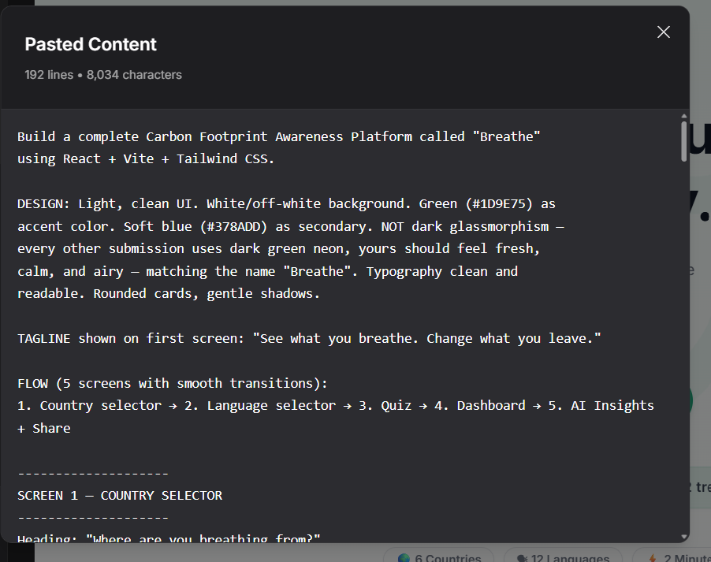

The project started with a master prompt defining the product vision, awareness-first approach, UI philosophy, and user journey.

---

### Accessibility & Localization

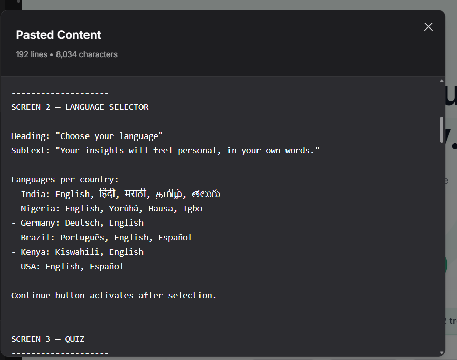

Designed for 6 countries and 12 languages to make sustainability insights more accessible and culturally relevant.

---

### Carbon Calculation Framework

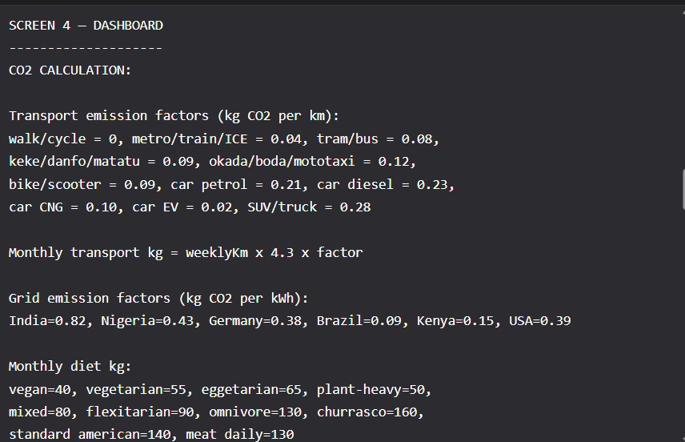

Country-specific transport, energy, food, and shopping emission factors were defined to generate realistic monthly carbon estimates.

---

### Emotional Translation & What-If Simulator

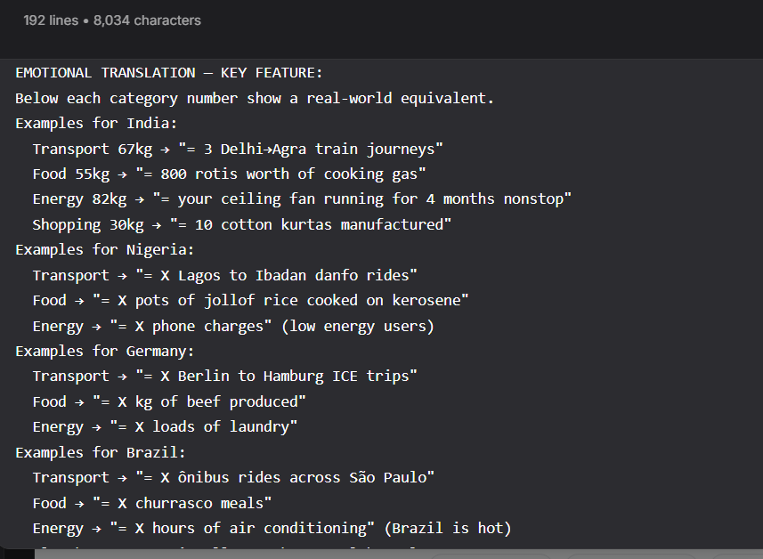

A core design goal was transforming carbon data into relatable real-world equivalents rather than displaying raw numbers alone.

---

### UI Refinement Iterations

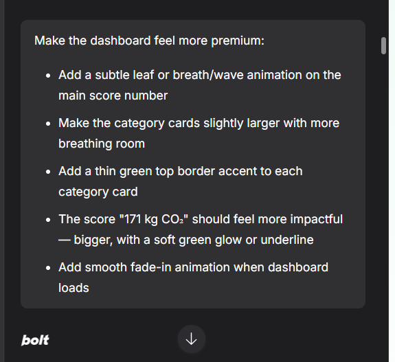

The interface was iteratively improved through prompt-driven refinement, focusing on clarity, visual hierarchy, and usability.

---
## Architecture

```text
User
 │
 ▼
React + TypeScript Frontend
 │
 ▼
Carbon Footprint Calculation Engine
 │
 ├── Country & Language Layer
 │
 ├── Impact Comparison Engine
 │
 └── What-If Simulation Engine
         │
         ▼
      Gemini API
         │
         ▼
 AI Recommendations & Chatbot
         │
         ▼
 Personalized Awareness Dashboard
```

---
## Repository Structure

```text
src/
├── components/
├── contexts/
├── data/
├── utils/
├── __tests__/
├── App.tsx
└── main.tsx

public/
screenshots/

CONTRIBUTING.md
SECURITY.md
LICENSE
README.md
```

---

## Testing

The application was tested across multiple user flows, including:

* Carbon footprint calculation
* Country-wise footprint comparisons
* AI-powered recommendation generation
* Chatbot interactions
* Multilingual content rendering
* Responsive layouts across devices
* Input validation scenarios

Special attention was given to handling unusually high or low consumption values to ensure stable output generation.

---
## Testing & Quality Assurance

The application includes automated unit and component testing using **Vitest**, **React Testing Library**, and **Jest DOM**.

### Test Coverage

| Metric     | Coverage |
| ---------- | -------- |
| Statements | 97.43% |
| Branches   | 89.90% |
| Functions  | 98.38% |
| Lines      | 98.57% |

### Test Results

- 135 automated tests passing
- 17 test suites passing
- Calculator engine testing
- Security and sanitization testing
- Translation validation
- Country configuration validation
- Chatbot interaction testing
- What-If simulator testing
- Component rendering tests
- Accessibility-focused tests
- Error handling and fallback testing

Testing was performed to ensure consistent behavior across different user flows, languages, and carbon-footprint scenarios.

---

## Security & Reliability

Several security and resilience measures were implemented to improve application stability and protect user interactions.

### Security Highlights

- Input sanitization against XSS attacks
- API key validation before Gemini requests
- Environment-variable based secret management
- Content Security Policy configuration
- Graceful AI failure handling
- Error Boundary protection
- Secure localStorage usage

### Security Measures

* Environment-variable based API key management
* Input sanitization and validation
* Safe handling of Gemini API responses
* Graceful fallback behavior when AI services are unavailable
* Error Boundary implementation for runtime error isolation
* Content Security Policy (CSP) configuration
* Secure client-side storage practices
* API error handling for rate limits and invalid requests

### Reliability Features

* Retry logic for temporary API failures
* Sample-response fallback mode when AI services are unavailable
* Defensive error handling throughout the application
* Production build verification before deployment

No private API keys or secrets are stored in the repository.


## Performance & Efficiency

To maintain a smooth user experience:

* React components were structured to minimize unnecessary re-renders
* API calls are triggered only when required
* Frontend assets are optimized using Vite
* Lightweight UI components were preferred for faster loading times
* Responsive layouts were implemented for desktop and mobile users

---

## Accessibility & Inclusivity

Breathe was designed to be accessible to a diverse audience.

* Support for 12 languages
* Support for users across 6 countries
* Mobile-first responsive design
* Keyboard accessible controls
* Screen-reader friendly UI
* Semantic HTML structure
* Clear information hierarchy
* Accessible color contrast
* Responsive layouts for different screen sizes
* Readable content and intuitive navigation
* Sustainability concepts explained using relatable examples

The goal is to make carbon awareness understandable and actionable for users from different backgrounds.

---
## Performance Optimizations

- Lazy rendering where appropriate
- Optimized React component structure
- Minimal API requests
- Lightweight Vite production builds
- Cached localStorage data
- Responsive mobile-first design

---

## Environment Variables

Create a `.env` file in the project root.

```env
VITE_GEMINI_API_KEY=your_gemini_api_key
```

The repository does not contain any private API keys.

---

## Local Setup

```bash
git clone <repository-url>

cd breathe

npm install

npm run dev
```

---

## Production Build

```bash
npm run build
```

---
## Development Quality

The project follows:

- TypeScript-based development
- Automated testing with Vitest
- React Testing Library component tests
- ESLint code quality checks
- Reusable component architecture
- Documented contribution guidelines
- Security review documentation

---

## Prompt Wars Submission

Challenge: Prompt Wars Virtual Challenge #3

Theme: Carbon Footprint Awareness Platform

Submission Includes:

* Source Code Repository
* Deployed Web Application
* Prompt Engineering Documentation
* AI Tool Usage Documentation
* LinkedIn Project Write-Up

---

## Future Enhancements

* Community sustainability challenges
* Team and organization leaderboards
* Carbon reduction streaks
* Regional sustainability benchmarks
* Advanced AI coaching
* Additional countries and languages

---
## Project Documentation

- CONTRIBUTING.md
- SECURITY.md
- LICENSE

---

## Author

Lakshita Banothe

Built as part of Prompt Wars Virtual Challenge #3.
